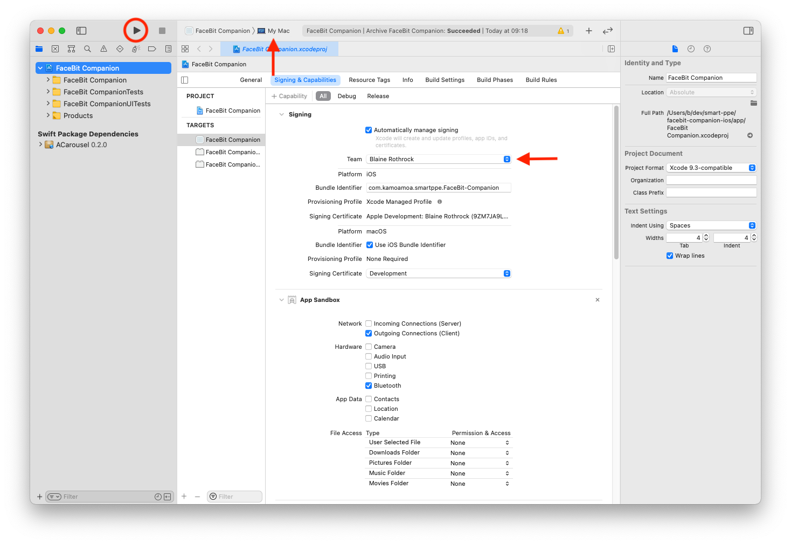
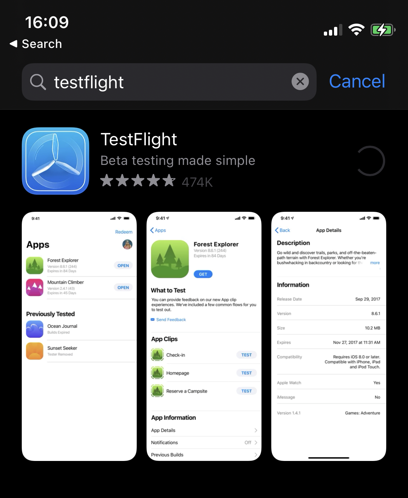
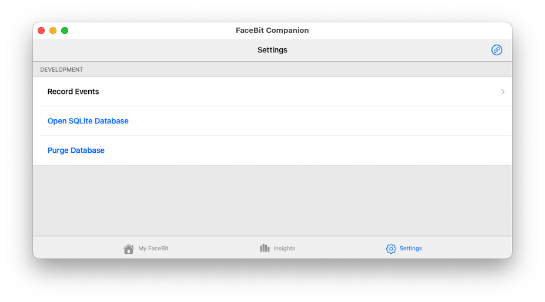
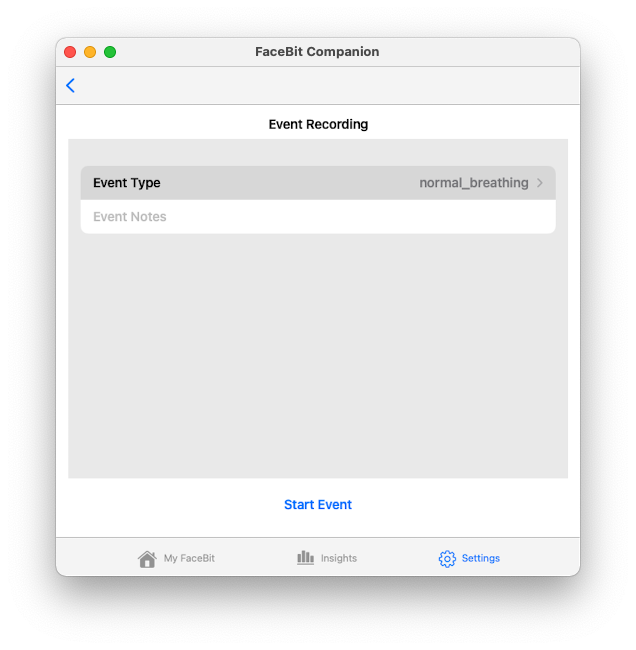
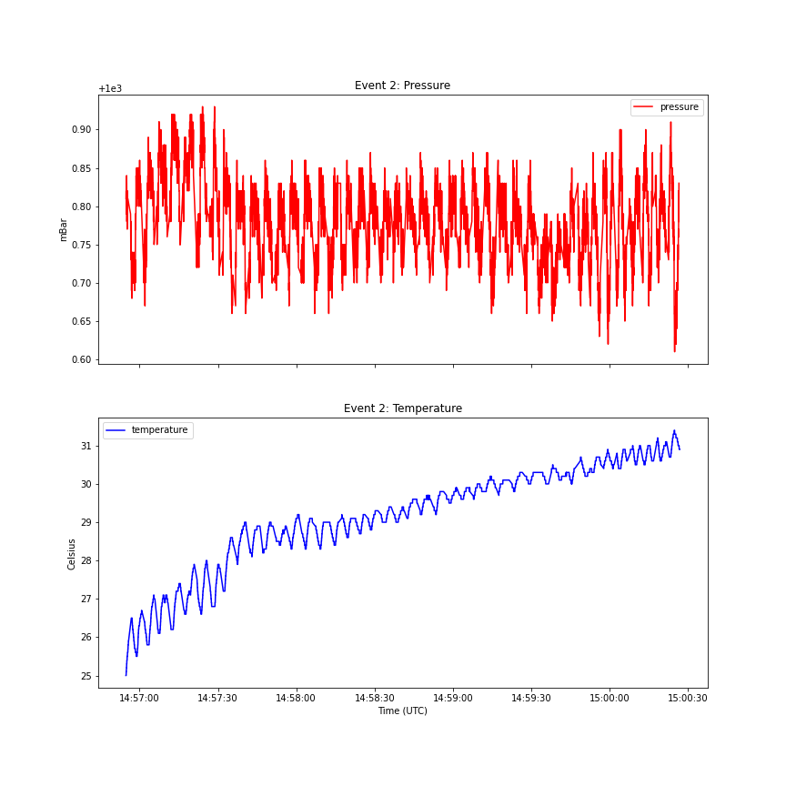
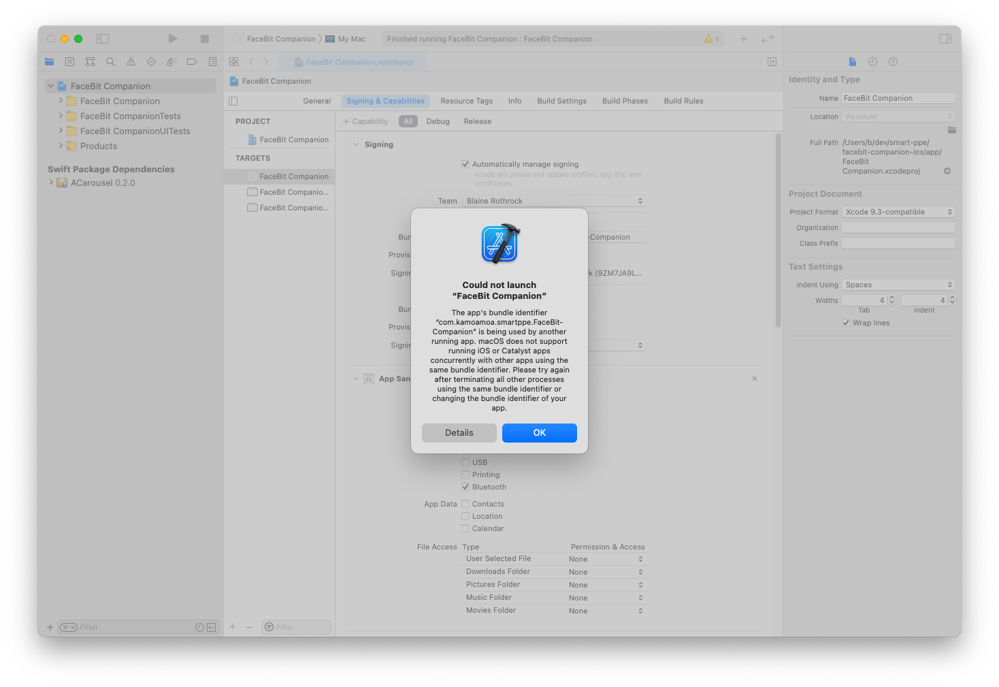
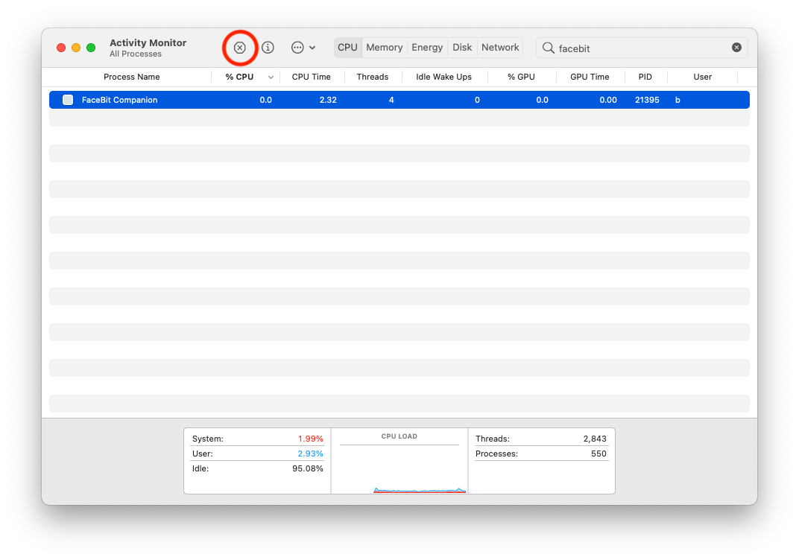

# Introduction
The FaceBit Companion App is a iOS/macOS application that manages sensor data from a FaceBit device. The app collects, stores, and processes data into insights that can be presented to the user of FaceBit. 

The application is built as a [Catalyst](https://developer.apple.com/mac-catalyst/) application which allows the same code to run on both iOS and MacOS. 

# MacOS App
## Running macOS Application (No XCode- Release)

* Download the latest version hosted [here](https://nuwildcat-my.sharepoint.com/:f:/g/personal/bry4768_ads_northwestern_edu/Emgr5TQZ8cNErO6qYIV2aekBzwq1hjrX_bgnD944xHSVkg?e=wGTVVs) (Requires Northwestern Office 365 auth).
* Extract the app file and run it. 
    * May require security permission. System Preferences->Security & Privacy->General->Allow Applications

## Running MacOS Application (XCode - Development)
1. On macOS 11, download the latest version of XCode from the AppStore
2. Clone this repository
3. Open `app/FaceBit Companion.xcode.proj` in XCode
4. Update the app signing to your Apple Id
5. Select **My Mac** from the device drop down in XCode's tool bar.
6. Run using **Cmd+r** or run button in the top left.

# iOS App
## Running iOS Application (No XCode - Release)
* on a iOS Device, download TestFlight from the AppStore
* Slack Blaine to add you to the app team as a Developer
* Accept the invite via email on your iOS Device
* Download the app via TestFlight (should receive notification for new builds)

## Running on iOS Application (XCode - Development)
**Note**: Requires a active [Apple Developer Account](https://developer.apple.com/)

**Note**: Bluetooth is not supported on iOS Simulators. The application will run on a simulator but you will not be able to interact with the FaceBit Sensor Board.

Follow the same steps as running the MacOS Application, but instead of selecting **My Mac**, connect your physical iPhone and select it from the  device drop down in XCode's tool bar.

# App Functionality
## Homepage
Under development ... TODO:

## Connect FaceBit Sensor
Following instruction in the [Embedded Firmware repository](https://gitlab.com/ka-moamoa/smart-ppe/embedded-firmware) for setting up the FaceBit Sensor. 
* Upon app start the device will search for the FaceBit device (broadcasted name `SMARTPPE`)
* The home page will display `active` when connected and the status indication will be filled.
* To reconnect, press the status indication to start the bluetooth search.

## Data Collection
**NOTE**: In active development. The the time of writing, only Pressure and Temperature data is stored.

Data is stored in a local SQLite database. Raw readings on the device are stored in a transactional table. To explore the database open the settings tab and select **Open SQL Database** (macOS) or **Share SQLite Database** (iOS). [SQLite DB Browser](https://sqlitebrowser.org/) is a free cross-platform application for interfacing with SQLite Databases.

### Event Recording
Event recording is used to tag data with events for data exploration. Access event recording from **Settings->Record Events** with the FaceBit Sensor Board connected. Enter event metadata and press **Start Event**. Perform the event (e.g. Deep Breathing) and then select **Stop Event**. 

When a event is started a new event record is stored in the database. When Stopped, all transactional recording between the start and end time are updated (tagged) with the event. See the Python exploration below for accessing events and plotting.

# Data Exploration
SQLite was selected as the datastore for easy access to any programming language or tool for data exploration. 

## Python
`data-exploration/` contains a Jupyter Notebook for reading a SQLite Database and plotting temperature and pressure data of all event. To Run: 
* Create a new Python environment
    * e.g. from the `data-exploration` directory, run: `conda env create -f env.yml`
* Open the jupyter notebook:
    * With [Visual Studio Code](https://code.visualstudio.com/docs/python/jupyter-support)
    * With Jupyter server: run `jupyter notebook` from the `data-exploration` directory.
* Update database path in the first cell of the notebook
    * **Note**: if using macOS just update the username.

# Troubleshooting
## MacOS Version
Since the application is built using [Catalyst](https://developer.apple.com/mac-catalyst/) which is a new feature of Apple ecosystem development, macOS Big Sur (11) is required to run the application on Mac.

## MacOS Running
Occasionally when developing on macOS, The application does not properly close when stopping the application in Xcode and the following error is displayed. To fix, open Activity Monitor and search `facebit` and force quit the application.

## Barometer Initialization
Currently, there is a issue with the barometer initializing on the FaceBit Sensor Board. For the best results, run the device using J-Link and powered by battery. Once running, you can disconnect the device from the J-Link.